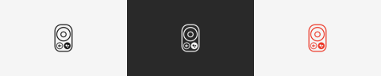

# RemoteBuddy


[简体中文](README.md) · **English**

Turn a Google Chromecast Voice Remote into a configurable Mac remote and microphone.
The interface follows the macOS language preference: English or Simplified Chinese.



Menu bar icon: light mode, dark mode, and microphone active (red).

- Receive ATVV Bluetooth microphone audio, decode it and route it to BlackHole 2ch.
- Map buttons to shortcuts, volume controls, applications or websites; saved changes apply immediately.
- Tap the voice button to toggle the microphone, or hold it to talk. Other buttons have no separate long-press mapping.
- Login startup, release protection and a workaround for missed single presses on the tested remote.

## Tested remote

| Item | Verified information |
| --- | --- |
| Product | **Google Chromecast Voice Remote**, supplied with Chromecast with Google TV |
| Bluetooth device name | `Chromecast Remote` |
| Model identifier reported by Bluetooth Device Information | **ABBEY** |
| Firmware / Software | **22.2 / 22.2** |
| USB/HID Vendor ID / Product ID | `0x18D1` / `0x9450` |
| Button ATT report handle | `0x0046` |
| Hardware-tested platform | Apple Silicon, macOS 26.5.2 |

ABBEY is the identifier read from the device, not a generic name for all Google TV remotes.
Google TV Streamer Voice Remote, third-party replacement remotes and other firmware
versions have not been validated. Universal Intel / Apple Silicon binaries are built,
but Intel hardware and all older macOS versions have not been tested.
[Google's remote overview](https://support.google.com/chromecast/answer/10116742?hl=en).

## Why PacketLogger is required

**PacketLogger is a runtime dependency of the current button workaround, not just a diagnostic logger.**
The normal macOS HID path discards the tested remote's short single-button reports.
The helper uses PacketLogger's live HCI stream to recover complete press/release
notifications. You do not need to open its GUI; the installed helper starts capture
when needed. Voice uses a separate BLE / ATVV path and does not depend on PacketLogger.

Button path: `Remote → PacketLogger → Local helper → RemoteBuddy → Mac key events`.

## Install on another Mac

Public installation archives belong in the project's [Releases](https://github.com/Kaliscuit/RemoteBuddy/releases).
GitHub's source-only ZIP has no built application; build it using the commands below.

| Archive | BlackHole 2ch | Python runtime | PacketLogger |
| --- | --- | --- | --- |
| `Public`: for public distribution | Downloaded from its official website and verified during setup | Included | Obtained from Apple by the user |
| `Personal-Complete`: for the owner's other Macs and migration tests | Included | Included | The owner's original copy is included and detected automatically |

A separate `Local-Offline` dependency cache archive does not include PacketLogger;
it is not the personal complete archive. Personal archives must not be published.
The target Mac needs no Homebrew, Xcode or preinstalled Python.

**For the public archive:**

1. Pair the remote in macOS Bluetooth settings and find its address in **System Information → Bluetooth**.
2. Sign in to [Apple Developer Downloads](https://developer.apple.com/download/all/?q=Additional%20Tools),
   download **Additional Tools for Xcode** compatible with your macOS, open the `.dmg`
   and locate/copy `PacketLogger.app`. Full Xcode is not required. The validated tool
   is PacketLogger 26.0.0 from Additional Tools for Xcode 26.5.
3. Extract the RemoteBuddy archive and run **Install.command**. Supply the PacketLogger
   path and your remote's address, review the plan and enter your administrator password.
4. Install the **RemoteBuddy Bluetooth Compatibility** profile in System Settings,
   restart the Mac, and allow RemoteBuddy's Bluetooth and Accessibility permissions.
5. Select **BlackHole 2ch** as the microphone in your dictation/recording app, then test buttons and voice.

**For Personal-Complete**, start the installer in step 3; PacketLogger is detected
automatically. Pairing, the remote address, administrator authorization, the profile
and system permissions must still be configured on the new Mac.

The app targets macOS 13. PacketLogger may require a newer version, which the
installer checks; the current personal archive's PacketLogger requires macOS 14+.
A full clean install still needs verification on the destination Mac.

See the [installation guide](docs/INSTALL.en.md). **Check.command** performs read-only
checks; **Uninstall.command** disables startup, the helper and capture profile.
The current app is locally signed, not Developer ID notarized; macOS may require
approval in System Settings before the first launch.

## Default mappings

| Remote button | Mac action |
| --- | --- |
| Direction ring / OK | Arrow keys / Return |
| Back / Power / Input | Delete (backspace) / Esc / Control+C |
| YouTube / Netflix | Page Up / Page Down |
| Home | Command+Space |
| Volume / Mute | System audio controls |
| Voice tap / hold | Fn+Space toggle / hold Fn |

Open **Button Settings…** from the menu bar to edit mappings. While settings are
open, the remote selects buttons for editing and mapped actions/audio output pause.
Direction and volume repeat while held, with a two-second forced release safeguard.

## Build from source

```sh
git clone git@github.com:Kaliscuit/RemoteBuddy.git
cd RemoteBuddy
./Scripts/test.sh
./Scripts/build-app.sh
./Scripts/fetch-dependencies.sh
./Scripts/package-release.sh
```

Development requires Xcode with the macOS 26 SDK (for CoreHID diagnostics) and
Python 3 (for tests). Outputs are in `dist/`. Dependency downloads, personal
configuration, build caches, captures and private archives are excluded from Git.

Documentation has English and Chinese counterparts:

- [Installation](docs/INSTALL.en.md) · [安装](docs/INSTALL.zh-CN.md)
- [Development](docs/DEVELOPMENT.md) · [开发与发布](docs/DEVELOPMENT.zh-CN.md)
- [Protocol](docs/PROTOCOL.md) · [按键兼容原理](docs/PROTOCOL.zh-CN.md)
- [Third-party notices](ThirdParty/README.md) · [第三方组件](ThirdParty/README.zh-CN.md)

## Privacy and compatibility

The root helper validates the connecting local user and filters notifications by
the configured remote address and ATT handle. Raw capture passes through a private
in-memory FIFO; the helper does not save capture files or upload them.
**The profile enables macOS's own raw Bluetooth logging**, which may include other
Bluetooth devices. Quitting the app stops live capture; use the disable tool or
remove the profile in System Settings to disable system capture.

Legacy `local.codex.RemoteMic` / `RemoteMic` identifiers preserve existing permissions
and mappings. User account, UID and remote address are configured at install time.
Currently, one user and one remote are supported per Mac.

License: **GPL-3.0-only**. See [LICENSE](LICENSE) and [third-party notices](ThirdParty/README.md).
